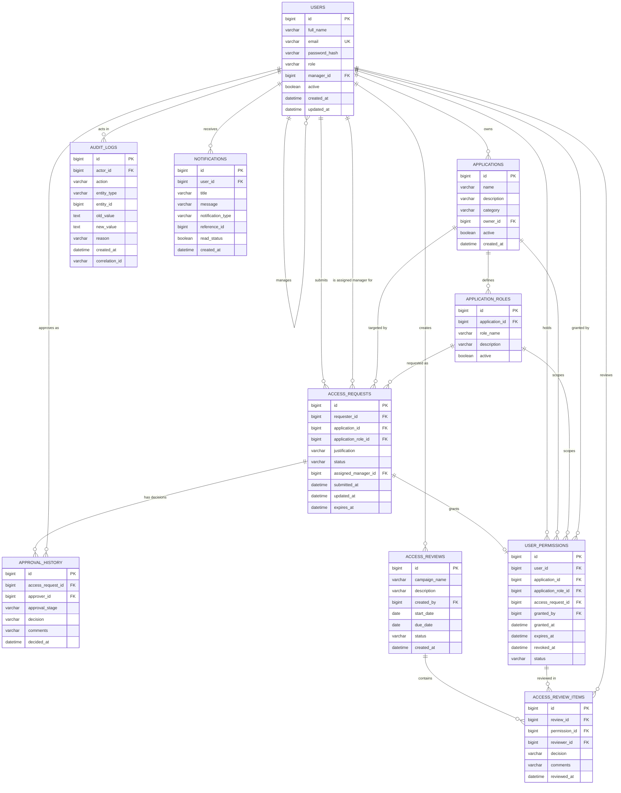

# AccessFlow — Entity Relationship Diagram

## Key relationship notes

- `users.manager_id` is a **self-referential FK** — this is how an employee's approving manager is determined.
- `access_requests.assigned_manager_id` is a **snapshot** of the requester's manager at submission time, so a later org-chart change doesn't retroactively change who approved (or should have approved) a historical request.
- `approval_history` is an **append-only** log of every manager/admin decision on a request — one request can have up to two rows (manager stage, admin stage), or more if you extend the workflow.
- `user_permissions.access_request_id` links a granted permission back to the request whose full two-stage approval produced it — permissions are never created directly.
- `audit_logs` is intentionally decoupled from strong FK cascade behavior on the entity side (actor can be null-safe on user deletion) so the trail survives account lifecycle changes.
